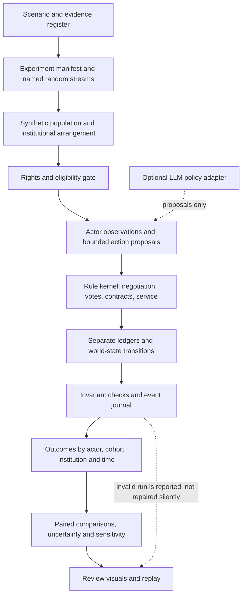

# Commons Collective Simulation Lab

## A concept for an agent-based institutional laboratory with Monte Carlo experiments

- **Short name:** CCSL
- **Repository location:** `agentic-model/`
- **Document:** `CONCEPT-IDEA.md`
- **Status:** concept developed into specification, plan, and backlog drafts; implementation not started
- **Version/date:** 0.3 / 19 September 2026
- **Research baseline:** Commons Collective commit `1c7b016b0dbb76d3623e7747ac6c327acfa45673`
- **Authorship boundary:** AI-assisted proposal; no endorsement by the research circle, institutions, or communities is implied.

> **Review gate update, 19 September 2026:** The user authorized [SPECIFICATION.md](SPECIFICATION.md), [PLAN.md](PLAN.md), and [BACKLOG.md](BACKLOG.md), and clarified that the direct AI Commons Collective must be the primary model. Those documents now define two required models: **AI Commons Collective** and **library-led open education**. No simulator, empirical result, calibrated population, production infrastructure, or validated policy recommendation exists as a result of these documents. Implementation, real API spending, empirical data collection, and public deployment remain separately gated.

## 1. Decision and purpose

**Use a subfolder, not a new public research section.** Keep this study in `agentic-model/`, now containing the concept and the authorized specification, plan, and backlog drafts. The working name is **Commons Collective Simulation Lab (CCSL)**. "Lab" signals an experimental environment; neither "digital twin" nor "prediction engine" is justified without real-world validation.

The folder is versioned in GitHub but is not added to the website navigation, report, overview, public-paper manifest, or downloadable research PDF. The current website build copies explicit sources; this folder is not among them. It is public repository material, **not confidential**: repository browsing and GitHub source archives can expose it. A later website release requires a separate editorial decision.

The central question is:

**Under which assumptions can collective institutions improve people's effective agency, useful access, contributor outcomes, and commons maintenance relative to credible alternatives, while remaining solvent, lawful, and accountable?**

The lab should make both positive and negative answers inspectable. A useful result might be that pooled procurement works without a new institution, that supplier coordination fails when participation cannot be sustained, or that an attractive commons covenant creates an unfunded liability.

The recommended approach is a **hybrid agent-based model**:

1. A transparent, deterministic kernel handles permissions, contracts, accounting, institutional rules, and event ordering.
2. Heterogeneous simulated actors make bounded decisions under incomplete information.
3. A Monte Carlo experiment runner varies uncertain inputs and stochastic events.
4. Optional LLM agents propose bounded actions or explanations in separately labeled experiments; they do not create legal authority, settle money, or stand in for human evidence.
5. A review interface exposes assumptions, uncertainty, distributional consequences, failed runs, and replayable examples.

This is an **institutional experiment**, not merely a set of chatbots role-playing a negotiation.

### Decisions proposed for approval

| Decision | Recommended choice | Reason |
|---|---|---|
| Required domains | Direct AI Commons Collective (default), plus library-led open education | Directly tests the central AI procurement/contribution/commons problem, then checks the institutional architecture in a concrete domain |
| Unit of simulation | People, organizations, contracts, and knowledge-object versions | Preserves authority, liabilities, and distinctions between people and their roles |
| Core method | Agent-based, event-ordered state transitions with stochastic behavior | Allows strategic interaction and path dependence without opaque accounting |
| Time basis | Explicit time-tick kernel; proposed one-model-day ticks, 30-tick accounting periods, 36 periods | Separates world time, process decision cadence, and display speed; tests renewal, grant expiry, maintenance, and reserve depletion |
| Reference implementation direction | Offline, headless, deterministic kernel first | Supports large batches and independent replay; framework selection remains open |
| LLM role | Optional policy adapter after a non-LLM baseline | Avoids confusing model-generated social behavior with measured behavior |
| Initial outputs | Scenario comparisons and assumption-sensitive regions | More defensible than a single "best institution" or success probability |
| Publication | GitHub review document only | Does not mix this new proposal with established public materials |

## 2. What the study must explain

The [research report](../research/report.md), [open-work register](../research/open-work.json), and [institutional example](../papers/institutional-blueprint-example.md) are the domain foundation. Their proposals remain proposals; existing hypothetical numbers are regression fixtures, not calibration data.

| Question / existing work ID | Candidate experiment | Outcome that could undermine the proposal |
|---|---|---|
| `procurement-benefit` | Individual buying versus an existing purchasing organization versus a new collective | Discounts disappear after switching, administration, participation, and quality costs |
| `contributor-bargaining` | Different authorized participation, outside options, multihoming, and commitment durations | High sign-up but insufficient deliverable supply or lawful bargaining commitment |
| `commons-additionality` | Covenant and grant designs against a matched no-intervention maintenance path | Transfers displace other support or never produce useful maintenance |
| `supplier-voice` | Buyer-dominated rules versus supplier representation and affected-party review | Capture, inaccessible participation, prolonged deadlock, or shifting burdens to nonmembers |
| `maintained-data-demand` | Open resources, direct licensing, in-house collection, and a governed maintained service | Maintenance and governance cost more than any independently measured quality gain |
| `private-institution-economics` | Demand loss, late payment, grant expiry, and service-cost shocks | Apparent profitability masks protected liabilities or an exhausted cash runway |
| `ranker-validation` | Eligibility-first selection with noisy evaluations and newcomer exposure | Rankings reward incumbency, fake feedback, or paid assurance rather than task performance |
| `mandate-comprehension` | Permission interfaces and withdrawal processes with heterogeneous comprehension | Participation grows while informed refusal or effective exit deteriorates |
| `energy-bargaining` | Alternative procurement and host-community agreements | Aggregate carbon improvement conceals local water, grid, or affordability burdens |
| `commons-credit` | Separate harm taxes, rent taxes, and capped commons credits | Fiscal cost, non-additional spending, or capture overwhelms the modeled benefit |

The first release would emphasize the first six questions at a bounded level. Scoped permission and refusal checks are mandatory throughout; actual human comprehension requires field evidence. The remaining questions need specialist modules and stronger external evidence. Simulation cannot establish whether a legal route is available or whether a proposed tax rate measures real marginal harm.

The main report's existing H1-H6 remain distinct: H1 procurement, H2 scoped mandates, H3 contributor terms, H4 commons additionality, H5 governance/capture, and H6 infrastructure burdens. The simulator should preserve these identifiers in its later experiment mapping rather than silently renumbering the research program. The report's proposed 200-consumer/40-contributor field cohort is a feasibility target, not calibration data, a power calculation, or the size of the simulated population.

For every experiment, write the hypothesis, comparator, outcome, mechanism, competing explanation, and rejection criterion **before** running it. Record thresholds as review decisions, not values chosen after seeing attractive charts.

## 3. Scope: enough institution, not the whole economy

### Two required worlds, one institutional research question

The primary/default world is the **AI Commons Collective itself**: consumers collectively procure AI services, providers respond to costs and credible alternatives, contributors separately authorize specific services/uses, and independent stewards receive and allocate commons support. Consumer service access, contributor payment, and commons finance remain distinct. Membership or AI use does not automatically mean data donation or training. The specification's [direct AI model](SPECIFICATION.md#s06-direct-ai-commons-collective-model-contract) makes these mechanisms explicit.

The second required world is a fictional **library-led open-education service** within an explicitly hypothetical jurisdiction. Include households/patrons, overlapping contributor roles, library buyers, service suppliers, an existing host organization, a proposed collective, and commons stewards. Represent affected nonmembers even when they never join or pay. The [library model](SPECIFICATION.md#s07-library-model-contract) has different resource-defect, accessibility, maintenance, and renewal dynamics while reusing the institutional kernel.

These are scenario variants of the same institutional thesis, not successive AI-model training iterations or replacements for the central problem. The considered community environmental-observation case is deferred; the current scope has exactly two required dropdown choices. Switching either choice replaces all simulation variables with that model's defaults and invalidates old asynchronous work, as required by the [reset contract](SPECIFICATION.md#s09-model-dropdown-and-complete-reset-transaction).

The institutional example proposes New York as a context requiring review. This concept does not convert that into an approved legal regime: an eventual New York scenario needs a dated, reviewed rule set. Preserve its initial adult-facing, low-risk OER scope, item-level public-domain/open-license/other authority checks, and exclusion of learner records, minors' data, and unresolved sensitive material. Synthetic patron demand is a modeling device, not a proposal to log real learner behavior.

Compare four arrangements:

- **A0 - Independent:** eligible buyers and contributors contract separately.
- **A1 - Existing host:** an existing library consortium or equivalent organization provides a limited shared service.
- **A2 - Procurement collective:** pooled buying with disclosed administration and exit costs.
- **A3 - Two-sided commons collective:** pooled buying plus separately authorized supplier representation and a commons covenant.

Keep the same initial population, service needs, rights constraints, and external shocks across paired comparisons. Institutional operating costs, grants, and participation support must be visible. Run both equal-resource comparisons and explicitly labeled different-funding comparisons. Do not give A3 free staff or a grant that is invisible in A0-A2.

These are bundled institutional arrangements. An A3-A0 difference does **not** identify the isolated effect of voting, a covenant, or procurement. Separate ablation/factorial experiments are needed for those claims.

### Later modules, not initial commitments

| Module | Additional representation required | Why not silently include it in version one |
|---|---|---|
| Community environmental observations | Station ownership, equipment/maintenance cost, freshness, coverage, measurement error, and correlated outages | Potential later robustness case; deferred to keep the direct AI commons problem central |
| Professional catalogs and cross-CMO cooperation | Rights chains, permitted repertoire, independent pricing, information-sharing constraints | Competition and copyright arrangements differ by jurisdiction |
| Contributor equity and investment instruments | Vesting, dilution, liquidity, risk, distributions, capital claims, and insolvency priorities | Equity is not cash compensation, guaranteed value, or automatic extra governance power |
| Workplace-data trust | Employer/worker/third-party authority, insolvency, custody, succession | A simulation must not imply bankruptcy-proof rights |
| Tax and commons credit | Separate bases, public budget, eligibility, additionality, administration | Different from the service operator's cash model |
| Energy and host community | Location/time-specific demand, grid mix, water, prices, baseline burdens | Monetary transfers do not erase environmental harm |
| Commons-authored RL objectives | Training/evaluation separation, held-out tasks, reward gaming | Behavioral simulation is not a model-training experiment |
| Multi-sector federation | Cross-collective mandates, fees, interdependence, spillovers | Aggregation can create new concentration and failure propagation |
| Infrastructure network | Alternative providers and bargaining at ten nodes | Node effects cannot be identified merely by drawing ten boxes |

### Non-goals

- Predicting an election, an individual's choices, a negotiated market price, or real institutional survival from fictional populations.
- Assigning a universal monetary value to personal data, privacy, culture, or agency.
- Automatically recognizing ownership of public information or royalties on open knowledge.
- Executing trades, contracts, payments, legal filings, or real data processing.
- Treating fictional participant names as models of the actual research-circle members.
- Training an AI model, collecting personal records, or creating a blockchain requirement.
- Replacing fieldwork, legal analysis, community decision-making, or controlled empirical evaluation.

## 4. Ontology: four meanings of "agent" must not be mixed

| Entity | Meaning | Example | Authority boundary |
|---|---|---|---|
| **World actor** | A modeled person or organization with state, constraints, observations, and a decision rule | Household, library, vendor, steward | Has only the capabilities and simulated mandates explicitly assigned |
| **Role assignment** | A capacity held by an actor; not another person | The same person is a patron, contributor, and elected representative | A role grants scoped powers, not extra population weight or unrestricted votes |
| **Institution/rule system** | Procedures, budgets, membership, mandates, and decision rights | Consortium, collective, affected-party council | Cannot override individual rights or create legal authorization by majority vote |
| **Execution agent** | Software that prepares, checks, runs, or explains an experiment | Scenario compiler or optional LLM policy adapter | Cannot alter frozen rules or results without a new version and manifest |

Knowledge objects, contracts, offers, mandates, evaluation observations, and receipts are **objects**, not people. A knowledge object may become input to an agent; it does not thereby receive a vote.

Use one stable synthetic `actor_id` across roles. Keep `household_id`, organization membership, beneficial interests, and representation links explicit. Count unique people separately from accounts, roles, memberships, messages, and contributions. Do not create cross-platform identities for real people.

### World actors and modeled roles

| Actor/role | Decisions | Required state / constraints | Observable outcomes |
|---|---|---|---|
| Household/patron | Adopt, refuse, switch, request service, delegate, complain | Budget, need, accessibility, outside option, privacy requirements, time | Accepted tasks, total cost, refusal success, unmet need |
| Professional contributor | Authorize a purpose, set a reservation offer, multihome, pause renewal | Authority, effort/cost, repertoire, deadlines, dependencies | Net receipts, uncompensated time, control, concentration of payments |
| Volunteer/community contributor | Contribute or stop, curate, participate in governance | Intrinsic motives, reciprocity, opportunity cost, community protocols | Retention, useful stewardship, burden, crowd-out |
| Library/institutional buyer | Procure, renew, support access, select eligible vendors | Public-interest duties, procurement constraints, budget, service quality | Access, full cost, continuity, actual switching |
| Vendor/model-service supplier | Offer, ration capacity, invest, renew, exit | Costs, capacity, margins, alternatives, compliance constraints | Accepted offers, fulfilled demand, concentration, failure |
| Commons steward | Maintain, prioritize, grant access, contest terms | Restricted funds, backlog, license obligations, community authority | Maintenance completion, freshness, coverage, public availability |
| Operator/secretariat | Administer, invoice, reconcile, enforce contracts | Staffing/capacity, unrestricted cash, liabilities, conflicts | Cost, delays, reserve position, continuity |
| Buyer/supplier representatives | Deliberate, propose, vote, disclose conflicts | Term, mandate, constituency, quorum and conflict rules | Representation, decision changes, exclusion, deadlock |
| Affected nonmember/council | Challenge, seek remedies, refuse where applicable | Exposure, access to review, participation barriers | Burdens, funded remedies, response times |
| Evaluator/auditor/ombud | Sample, review evidence, detect problems, resolve disputes | Independence, capacity, error rates, appeal procedure | Calibration, unresolved complaints, reversals, detection delay |
| Funder | Offer restricted support, taper, exit, impose disclosed conditions | Budget, time horizon, permitted uses, conflict limits | Runway, additionality, dependence, influence |
| Public authority / host community | Apply scenario-defined constraints or review decisions | External legal-policy regime, public budget, representation | Compliance events and burdens, not invented real-world legal approvals |

Some bodies can be procedures rather than autonomous agents in the initial world. Giving every committee an LLM is neither necessary nor evidence of institutional fidelity.

### Personas: test heterogeneity, not stereotypes

Proposed synthetic personas are **cross-cutting stress profiles**, not demographic predictions:

1. **Budget-constrained patron:** high need, little switching cash, limited time.
2. **Privacy-first patron:** binding restrictions on reuse; may rationally refuse a cheaper offer.
3. **Accessibility-constrained patron:** needs supported formats or assistance that raises service costs.
4. **Occasional user:** low demand; fixed dues can dominate any discount.
5. **Professional author/artist:** contribution is paid work with purpose-specific authority.
6. **Volunteer steward:** values public usefulness; may leave if payments displace recognition or autonomy.
7. **Multihoming contributor:** uses multiple institutions; membership is not exclusive supply.
8. **Small institutional buyer:** meaningful demand but weak procurement capacity.
9. **Established supplier / new entrant:** different capacity and evidence histories, not automatic quality rankings.
10. **Affected nonparticipant:** receives burdens without receiving member payments or votes.

A person can match multiple profiles. Generate correlated attributes and varied decision rules within each profile. Do not equate low income with low comprehension, any culture with a single preference, or refusal with irrationality. Protected attributes require a justified, consented research purpose; synthetic labels alone do not prove real fairness.

## 5. Knowledge and rights: a multidimensional spectrum

The report's mass-public, private, professional, synthetic, and community-held categories overlap. Do **not** implement them as a single ordered "data value" slider or as mutually exclusive quality classes.

| Axis | Illustrative state | Modeling consequence |
|---|---|---|
| Access | Public / restricted / confidential | Public accessibility is not blanket permission |
| Rights basis | Public domain / compatible open license / scoped contract / unresolved | Determines eligible actions; unknown required authority blocks them |
| Origin | Human-authored / observed / inferred / machine-generated / mixed / unknown | Separate provenance and evaluation assumptions |
| Structure | Structured rows / semi-structured records / text, audio, image, video / graph / embeddings | Integration and evaluation costs differ; greater structure does not confer authority |
| Personal or community interests | None established / personal / third-party / community protocols / unresolved | Review and refusal constraints can coexist with copyright permissions |
| Professional relationship | Volunteer / employment / commission / independent professional | Changes authority and opportunity costs; not intrinsic quality |
| Authorized purpose | Retrieval / inference context / evaluation / training / onward distribution | Each is a separate permission decision |
| Quality and freshness | Task-scoped latent quality, measured observations, age, coverage | Quality is uncertain and task-dependent, not inferred from price |
| Derivation | Version, parents, transformations, provenance confidence | Mixed inputs require lineage and authority review |
| Stewardship | Maintainer, maintenance backlog, continuity plan | Enables decay, repair, and loss-of-steward scenarios |

Use the existing [knowledge-object example](../examples/knowledge-object.json), [reputation observation](../examples/reputation-observation.json), and [component passport](../examples/component-passport.json) as **structural precedents**. They explicitly remain fictional, unverified, or unfilled. A simulator adapter must not silently promote them to verified permissions or evaluations.

A simulation fixture can declare a fictional rights state for testing, with `synthetic-assumption` provenance. This is not production authorization. Quality observations must distinguish simulated latent truth from what an actor or evaluator is allowed to observe.

Creative Commons-compatible aggregation means indexing, maintaining, and servicing legitimately reusable resources. A service fee is not a newly invented exclusive license to the underlying open work. Withdrawal can stop prospective contractual access where allowed; it does not automatically revoke an irrevocable open license, delete historical model influence, or erase third-party rights.

## 6. Proposed architecture and naming



**Text alternative:** freeze a scenario and randomness; generate a population; admit only authorized actions; process actor decisions through fixed rules; reconcile ledgers; check every transition; compare valid and failed runs; let reviewers inspect the full chain from assumption to event to outcome.

### Conceptual components

| Proposed name | Responsibility | Must not do |
|---|---|---|
| **World Kernel** | Explicit time-tick clock, deterministic transition order, permissions, balances, contracts | Derive world time from animation frames or ask an LLM to decide whether money balances |
| **Actor Policies** | Bounded-rational, heuristic, optimization, or optional LLM action proposals | Observe hidden truth or another actor's confidential state without authorization |
| **Institution Engine** | Mandates, membership, ratification, representation, appeals, succession | Conflate a favorable vote with lawful authority |
| **Experiment Runner** | Sampling plans, named seeds, scenario arms, repetitions, stopping rules | Drop failed or unfavorable runs |
| **Evidence Register** | Sources, assumptions, units, calibration and provenance | Convert a placeholder into an empirical estimate |
| **Outcome Ledger** | Financial and nonfinancial measures with denominators | Combine different ledgers or collapse rights into a welfare score |
| **Review Observatory** | Dials, comparisons, trace inspection, uncertainty, exports | Present an animation as causal proof |

Recommended future namespaces: `population.*`, `preferences.*`, `market.*`, `rights.*`, `institution.*`, `quality.*`, `finance.*`, `commons.*`, `policy.*`, `infrastructure.*`, `experiment.*`, and `observed.*`.

Potential identifiers are `scenario_id`, `arrangement_id`, `actor_id`, `role_id`, `object_version_id`, `mandate_id`, `contract_id`, `event_id`, `tick_index`, `phase_index`, and `run_id`. They are proposed vocabulary, **not a finalized schema**. Names should remain independent of any agent framework.

The next specification should compare a small custom kernel, an established agent-based modeling framework, and orchestration adapters against headless execution, replay, licenses, operating cost, typed actions, and independent validation. Existing Node accounting functions favor reuse or cross-language parity tests; they do not require every future model to use JavaScript.

## 7. Time-tick model, actor activation, and world transitions

**Time-tick is a first-class concept, not a detail deferred entirely to the specification.** The shared pattern to borrow from CoLab simulations is a large, inspectable variable space plus explicit actor types, an advancing simulation clock, and interchangeable decision policies. C1's Mariupol engine supplies a concrete tick-driven interaction precedent; C3 supplies distinct scripted, stochastic-surrogate, and live-model experiment tracks. This is a synthesis of inspected capabilities, not a claim that every precedent implements every variant.

### Three clocks and a proposed reference resolution

1. **Simulation clock:** `tick_index` advances by one when a world transition is committed. `tick_duration_model_days` defines how much modeled time that transition represents.
2. **Process/decision clocks:** actors and institutions act when their specific schedule or triggering event is due. Tasks, renewals, payments, governance, and maintenance need not all run at the same cadence.
3. **Wall/display clock:** runtime, playback speed, pause, and frame rate determine how fast a person sees results, not what the simulated world does. Provider latency is real experiment cost, not simulated bargaining delay unless that mapping is an explicit experimental assumption.

**Proposed, uncalibrated reference:** one tick = one model day; one accounting/decision period = 30 ticks; 36 periods = 1,080 ticks. A model day is a synthetic time unit, and a 30-day model period is not an actual calendar month. A real jurisdiction's calendar, business days, legal deadlines, and exact time boundaries require a reviewed calendar adapter or a finer-resolution scenario. The daily reference is a starting point for review, not an empirically optimal resolution.

This separates the existing monthly-style economic assumptions from the tick engine instead of making each animation frame or each LLM answer a "month." A daily task process can coexist with 30-tick accounting and event-triggered mandate withdrawal. A quiet tick may have no actor decision; scheduled events and state checks still have defined semantics.

### Tick contract and action boundary

Conceptually:

```text
world_state[t + 1], events[t]
  = advance_tick(world_state[t], due_events[t], proposed_actions[t],
                 frozen_rules, named_random_streams)
```

The scheduler supplies due events and creates bounded actor observations. Actors propose actions; the kernel validates and resolves them in declared phases; accounting and rights invariants run before the next state is committed. Each event records its tick, phase, affected actor/object, and causal predecessor where applicable.

- Use a declared boundary convention: a mandate expiring at tick `t` cannot authorize a new action at `t`. Preserve accrued obligations and any independently surviving license.
- Process effective expiry, revocation, shocks, and other due constraints before the actions they govern. Recheck authority at execution, not just when a proposal was produced.
- Specify an observation snapshot per phase and a stable tie/conflict rule. Later phases may observe committed earlier-phase changes; within-phase proposals must not gain hidden priority from thread completion order.
- Batch settlement and ratification only when due; do not repay an invoice or cast another vote merely because another tick occurred.
- Asynchronous agent responses return to a tick/phase barrier. A stale, late, missing, or invalid action receives the preregistered rejection/timeout treatment; an API completion race must not change institutional authority.
- Changing ticks, cadence, or boundary conventions creates a new scenario version. It is not merely a visual setting.

The event order is a research assumption because it affects who can act before prices, votes, and payments change. Proposed **phases within a tick**, with scheduled economic and institutional processes executed only when due:

1. Load the frozen institutional rules and prior committed state; initialize opening balances only at run start.
2. Apply scheduled external shocks, grant changes, expiry, and prospective revocations.
3. Produce each actor's permitted observation, including uncertainty and stale evidence.
4. Process join/leave/delegate decisions, retaining separate membership and mandate states.
5. Collect eligible buyer needs, contributor offers, and vendor offers.
6. Negotiate or match; record refusal, no deal, unmet demand, and unfulfilled commitments.
7. Apply required chamber ratification, conflicts review, and affected-party procedures.
8. Execute only eligible contracted service; draw fulfillment and task outcomes.
9. Recognize invoices and liabilities; settle cash only when its due event occurs.
10. Allocate authorized receipts, service expenses, and restricted maintenance funding.
11. Process complaints, audits, remedies, and appeals; update task-scoped observations.
12. Reconcile all ledgers; update due renewal decisions, maintenance, reserves, and next-tick state.

Initialize opening balances once at run start; subsequent ticks load the prior committed state rather than reset it. Between accounting periods, accumulate correctly dated obligations without recognizing recurring income or expenses twice.

The kernel should resolve ties and within-tick events deterministically. Compare alternative ordering and finer time resolution where results depend on timing. When changing tick duration, convert flow rates, schedules, decay, and event hazards consistently: a 10% per-period event probability cannot simply become 10% per-day. Preserve the same modeled horizon and compare declared discretization error against a finer reference. A daily model does not establish minute-level revocation or actual network latency.

### Deterministic actors and non-deterministic agent variants

These are **policy/execution modes**, distinct from actor type, persona, or institutional arrangement:

| Mode | Decision behavior | Repeatability claim |
|---|---|---|
| **P0 - Deterministic actor** | Scripted or deterministic state-to-action rule; no fresh policy randomness | Same observations, rule version, and tie rules yield the same action |
| **P1 - Seeded stochastic actor** | Probabilistic choice, response error, or adaptation using a named actor/process stream | Variable across seeds, reproducible for frozen inputs, engine, PRNG, and seed scheme |
| **P2 - Live generative agent** | A bounded model/tool policy proposes an action from the same permitted observation/action interface | Provider/model/prompt/sampling changes and live generation can vary; a seed is not a general repeatability guarantee |
| **P3 - Recorded-action replay** | Recorded, validated P1/P2 decisions are supplied at the original tick/phase | Replays the recorded trajectory with frozen state/rules; does not regenerate or validate the original behavior |

A world can mix modes, for example deterministic settlement and stewardship procedures, stochastic consumer choice, and selected live-agent negotiation roles. Every assignment is recorded by actor/role and version. The kernel and rights floor remain deterministic in all modes; actor proposals never receive authority to rewrite them.

P0 does not make an entire run deterministic if exogenous shocks or population generation vary. Conversely, P1 is stochastic as an experimental model but replayable computationally. Compare modes on the same institutional arrangement and matched permitted observations; compare institutional arrangements separately. Do not confound "the collective" with an upgraded model and attribute the difference to governance.

### Do not build the desired result into the rules

- A larger group does not automatically receive a discount. Suppliers need cost structures, capacity, alternatives, and an explicit offer rule.
- Contributor bargaining leverage depends on deliverable authorized supply and credible alternatives, not membership counts alone.
- Separate easy contribution/multihoming from a lawful, sustained bargaining commitment. Do not assume public information can be withheld.
- A governed dataset does not automatically outperform open or in-house alternatives. Assign task-specific quality/freshness hypotheses and test null or negative effects.
- Paid assurance buys an evaluation service, not a favorable score.
- Representation has decision costs and possible benefits; neither is guaranteed.
- Philanthropic support has restrictions, expiry, and opportunity cost. It is not recurring earned income.
- Commons reinvestment may crowd out existing support. Gross transfers are not automatically additional public benefit.
- A rights floor is a constraint, not a slider allowing enough revenue to cancel prohibited conduct.

At minimum, compare two behavioral families, such as bounded cost/quality choice and aspiration/adaptation rules. Later add strategic bargaining and bounded LLM policies as separate structures. Differences between these families are **structural uncertainty**, not merely another random seed.

## 8. Variable catalogue and control discipline

### A parameter is more than a slider

Every configurable input needs a definition, unit, scope, responsible rule-maker, feasible domain, exploration range, reference value, evidence status, source, uncertainty treatment, dependence assumptions, and review date.

Distinguish:

- **D - design control:** a proposed choice by an identified institution, subject to its authority.
- **E - experiment setting:** a researcher-controlled choice about the synthetic experiment, not power to set the real population or economy.
- **U - uncertain input:** external conditions or an unobserved quantity, not something an operator can simply choose.
- **H - heterogeneous attribute:** varies across actors or objects.
- **R - rule/constraint:** an eligibility or accounting condition; not tradable against benefits.
- **O - observed/output:** computed from events, not independently adjustable.

Evidence labels should be `measured`, `externally-estimated`, `elicited`, `illustrative`, `normative-choice`, or `unknown`. A numeric value without provenance is not "calibrated." An unknown mandatory rights field blocks the relevant action; an unknown nonmandatory parameter can be explored only under an explicit assumption.

Store money as integer minor units with a currency and period; distinguish cents from the existing annual whole-dollar operator fixture. Use `_bps` for allocation shares (0-10,000), `_prob` for probabilities (0-1), `_count` for nonnegative integers, and explicit time suffixes. Ranges below are **admissibility domains or proposed stress grids**, not estimates of real-world plausibility.

### 8.1 Population, access, and behavior

| Proposed variable | Class / unit | Domain or exploratory treatment | Why it matters |
|---|---|---|---|
| `population.eligible_household_count` | E/U / count | Proposed synthetic scale tests: 100, 1,000, 10,000; a real eligible population would need evidence | Scalability and aggregation, not independent study sample sizes; actual membership is endogenous |
| `population.contributor_role_share` | U / fraction | 0-1; overlaps with household roles | Avoids counting a contributor as an extra person |
| `population.institutional_buyer_count` | E/U / count | Initial eligible buyer pool; compare multiple independent buyers | Revenue concentration and procurement power; contracting participation is endogenous |
| `population.vendor_count` | U / count | Stress cases: 1, 2, 3, 5, 10 | Competition and outside options |
| `population.network_structure` | U / categorical graph | Independent, clustered, hub-dominated | Recruitment, influence, failure propagation |
| `preferences.task_demand_per_period` | H / count | Nonnegative; overdispersed distributions if supported | Value of access and capacity needs |
| `preferences.budget_cents_per_period` | H / cents | Nonnegative joint distribution with need, not a universal average | Affordability and unmet need |
| `preferences.participation_time_hours` | H / hours per period | Nonnegative; accessibility constraints explicit | Hidden cost of governance and contributions |
| `preferences.opportunity_cost_cents_per_hour` | H / cents/hour | Nonnegative; report unpaid time separately too | Burdens that cash-only accounting misses |
| `preferences.minimum_quality` | H / task-specific threshold | Within the declared quality metric | Service acceptability, not universal AI quality |
| `preferences.reuse_constraints` | R/H / allowed-purpose set | Explicit permitted/refused purposes | A cheaper offer cannot silently override refusal |
| `preferences.comprehension_prob` | H/U / probability | Interface- and task-specific; unknown without evidence | Nominal opt-in is not informed permission |
| `preferences.switching_cost_cents` | H/U / cents per switch | Nonnegative; dependence on lock-in and accessibility | Credibility of exit |
| `preferences.intrinsic_contribution_weight` | H/U / utility parameter | Declared scale, including zero; no demographic shortcut | Volunteer motivation and possible crowd-out |
| `preferences.recognition_reciprocity_effect` | H/U / declared behavioral coefficient | Include zero, positive, and crowd-out hypotheses | Test service usefulness, recognition, and reciprocal contribution rather than assuming cash alone motivates |
| `preferences.adaptation_rate` | U / bounded coefficient | 0-1 under an explicitly defined update rule | Trust, aspiration, and renewal dynamics |

Preference weights are latent model parameters, not measurements of human worth. If no credible weights exist, retain multiple outcomes and hard requirements instead of inventing a common utility scale.

### 8.2 Market and supplier response

| Proposed variable | Class / unit | Domain or exploratory treatment | Why it matters |
|---|---|---|---|
| `market.baseline_price_cents` | U / cents per defined service-period | Positive or explicit free alternative | Comparable quality and service scope required |
| `market.vendor_fixed_cost_cents` | U / cents per period | Nonnegative | Whether aggregation can actually lower costs |
| `market.vendor_marginal_cost_cents` | U / cents per accepted task | Nonnegative; capacity effects separate | Prices cannot be assumed costless |
| `market.capacity_tasks_per_period` | U / count | Nonnegative | No deal or rationing despite high demand |
| `market.offer_policy` | U / versioned behavioral family | Cost-plus, reservation-based, bounded bargaining | Avoids forcing a collective discount |
| `market.outside_option_value_cents` | H/U / cents per decision period | Actor-specific, compatible with constraints | Threats and alternatives on both sides |
| `market.contract_length_periods` | D / positive integer | Proposed comparison: 1, 3, 12 | Commitment, renewal, lock-in |
| `market.contributor_reservation_cents` | H/U / cents per authorized service/use | Nonnegative; include effort and alternatives | Supply availability and net benefit |
| `market.multihoming_allowed` | R/D / boolean with scope | Generally permitted unless a reviewed constraint is modeled | Membership is not exclusive control |
| `market.commitment_fulfillment_prob` | U / probability | Conditional on authority, capacity, and incentives | Difference between stated and deliverable supply |
| `market.payment_delay_periods` | U / nonnegative integer | Include late/default events explicitly | Liquidity versus annual surplus |
| `market.vendor_exit_hazard` | U / probability per period | May depend on losses and correlated shocks | Continuity and stranded users |
| `market.synthetic_substitution_effect` | U / signed task-specific coefficient | Negative, zero, and positive scenarios | Synthetic supply can complement or substitute for maintained human input |

Price, capacity, concentration, switching, and demand are usually dependent. A scenario with one supplier and easy switching needs a stated alternative, not an impossible combination of sliders.

### 8.3 Mandates, rights, governance, and enforcement

| Proposed variable | Class / unit | Domain or exploratory treatment | Why it matters |
|---|---|---|---|
| `rights.purpose_authority` | R / object-purpose-state map | Authorized in synthetic fixture / denied / unresolved | Admission before optimization |
| `rights.mandate_expiry_period` | R/D / period index | Explicit end or reviewed renewal procedure | No indefinite permission by omission |
| `rights.prospective_revocation_rule` | R / event-order rule | Immediate next eligible event in the reference design | Prevents new unauthorized service |
| `rights.historical_use_treatment` | R / categorical contract/license rule | No blanket erasure guarantee | Separates prospective exit from historical processing |
| `institution.entry_fee_cents` | D / cents | Reference: zero; alternatives explicitly distinguish membership from optional services | Protects the free-entry concept from accidental dues |
| `institution.optional_service_fee_cents` | D / cents per period | Nonnegative, transparently waived/subsidized where modeled | Service economics without pay-to-vote |
| `institution.chamber_composition` | D / allocation and eligibility rules | Buyer, supplier, affected-party representation | Who can change which decisions |
| `institution.quorum_bps` | D / basis points | 0-10,000 with an explicit eligible denominator | Participation and deadlock |
| `institution.ratification_rule` | D/R / rule family | Required separate chambers or other reviewed rule | A global majority need not authorize every change |
| `institution.conflict_rule` | R/D / recusal and disclosure procedure | Conflicted votes/decisions explicitly treated | Vendor/funder influence and capture |
| `institution.participation_support_cents` | D / cents per period | Nonnegative, with an actual funding source | Participation cannot be assumed free |
| `institution.review_capacity_cases` | D/U / cases per period | Nonnegative | Queueing, access, enforcement limits |
| `institution.audit_detection_prob` | U / probability conditional on violation and audit | 0-1, with false positives also modeled | Audit labels are not perfect enforcement |
| `institution.remedy_cost_cents` | U / cents per substantiated case | Nonnegative; funding and recovery specified | A right without a funded route may be ineffective |
| `institution.influence_network` | U / graph/weights | Disclosed correlated interests; not a demographic trait | Capture and coalition dynamics |
| `institution.succession_rule` | R/D / procedure | Orderly closure, successor review, custody, export | Failure must not transfer data authority automatically |

Mandatory rights protections are identical across the compliant arrangement comparisons. An adversarial violation experiment is separately labeled, records the violation, and cannot count the resulting gains as an eligible policy recommendation.

### 8.4 Quality, information, and knowledge maintenance

| Proposed variable | Class / unit | Domain or exploratory treatment | Why it matters |
|---|---|---|---|
| `quality.latent_task_performance` | U / metric specific to task | Hidden synthetic state, never automatically revealed to actors | Separates simulated truth from evidence |
| `quality.evaluation_sample_count` | D / count | Nonnegative; zero means unmeasured | Uncertainty and affordability of evaluation |
| `quality.evaluator_error` | U / measurement-error model | Declared bias, variance, false positives/negatives | No perfect verification by assumption |
| `quality.decay_per_period` | U / task-specific coefficient | Including no decay; bounded by metric domain | Value of freshness |
| `quality.maintenance_effect` | U / signed response function | Include zero, diminishing, and harmful effects | Spending is not guaranteed improvement |
| `quality.coverage_by_group` | O / task availability fraction | Named group and denominator | Average quality can conceal exclusion |
| `quality.newcomer_exposure_bps` | D / basis points within eligible candidates | 0-10,000; no bypass of required evidence | Discovery versus incumbency |
| `quality.observation_expiry_periods` | D/U / positive integer | Task/version dependent | Old evidence cannot imply current quality |
| `quality.manipulation_attempt_rate` | U / count or probability per opportunity | Adversarial stress assumption | Fake feedback, false provenance, Sybil accounts |
| `quality.integration_effort_hours` | U / hours per object/service integration | Depends on structure, provenance, accessibility, and existing tooling | Structured or governed data must demonstrate, not assume, lower delivery cost |
| `quality.failed_task_rate` | O / failures/attempted eligible tasks | Separate denied, not attempted, and unmet demand | Prevents cherry-picking accepted tasks |

### 8.5 Finance, commons funding, and philanthropy

| Proposed variable | Class / unit | Domain or exploratory treatment | Why it matters |
|---|---|---|---|
| `finance.opening_unrestricted_cash_cents` | D/U / cents | Nonnegative; external source explicit | Launch solvency and runway |
| `finance.operator_fixed_cost_cents` | U / cents per period | Staffing, accessibility, legal, support, evaluation | Full operating cost |
| `finance.service_direct_cost_cents` | U / cents per unit/service | Separate from pass-through funds | Sustainable earned income |
| `finance.contributor_share_bps` | D / basis points of named eligible receipt pool | Joint allocation simplex | A contractual entitlement, not arbitrary cash available to spend |
| `finance.commons_share_bps` | D / basis points of the same named pool | Joint allocation simplex | Commons covenant with explicit funding base |
| `finance.operations_share_bps` | D / basis points of that pool | Joint allocation simplex | No hidden administration |
| `finance.reserve_share_bps` | D / basis points of that pool | Completes exactly 10,000 | Conservation and disclosed rounding |
| `finance.reserve_target_periods` | D / nonnegative periods of defined cash costs | Stress grid: 0, 3, 6, 12 | Liquidity requirement, not cash already held |
| `finance.bad_debt_prob` | U / probability conditional on payer and period | Correlated with shocks if justified | Invoice is not cash |
| `commons.external_grant_cents` | D/U / cents per scheduled installment | Restricted use and receipt date explicit | Not interchangeable with operator revenue |
| `commons.grant_end_period` | U/D / period index | Explicit abrupt/tapered alternatives | Dependence and post-grant survival |
| `commons.maintenance_backlog` | O/state / defined work units | Nonnegative; accessibility work not omitted | Stock of unmet stewardship |
| `commons.displacement_fraction` | U / fraction of modeled new support | 0-1 in the initial definition | Additionality versus substituting for existing support |
| `commons.funder_influence_rule` | R/D / voting/approval constraints | No automatic control from payment | Patronage and governance capture |
| `commons.public_access_state` | R/O / access/license state and availability | Continued lawful reuse tracked separately from service uptime | Prevents enclosing the commons |

Allocation shares are jointly constrained, not independently sampled percentages. The 40/30/20/10 split in the existing toy calculator is one **illustrative receipt waterfall**, not a recommended allocation for all services or the operator's entire turnover.

### 8.6 Later policy, energy, and infrastructure variables

| Proposed variable | Class / unit | Scope and caution |
|---|---|---|
| `policy.tax_base_kind` | D/R / categorical | Harm-linked activity, economic rent, profit, or revenue are different bases |
| `policy.tax_rate` | D/U / units matched to base | Currency/unit for harm charges; fractions for monetary bases |
| `policy.credit_cap_bps` | D / fraction of pre-credit liability | Existing 40% cap is hypothetical, not law |
| `policy.eligible_additional_spend_cents` | U/O / cents | Reviewed additionality, no double-counted deduction/credit |
| `policy.public_administration_cents` | U / cents per period | Fiscal cost, enforcement, and displaced spending |
| `infrastructure.energy_kwh` | U/O / kWh by location/period | Requires measured or explicitly estimated workload coefficients |
| `infrastructure.emissions_kg_per_kwh` | U / kgCO2e/kWh | Location/time and average-versus-marginal method disclosed |
| `infrastructure.water_liters` | U/O / liters with withdrawal/consumption boundary | Not inferred from carbon or a universal token coefficient |
| `infrastructure.host_cost_cents` | U/O / cents by affected group | Energy bills, infrastructure allocation, and compensation separate |
| `infrastructure.node_capacity` | U / node-specific units | Bottlenecks, alternative routes, and migration costs |
| `infrastructure.common_failure_shock` | U / correlated event process | Model/cloud/CDN failures may not be independent |

Retain the ten IDs from the [node-mechanisms register](../research/node-mechanisms.json): `protocols`, `browser-agent`, `domain-app`, `cdn`, `identity-consent`, `database-server`, `model-compute`, `provenance-validation`, `settlement`, and `community-energy`. At each node distinguish **market**, **policy**, **non-market**, and **philanthropic** interventions. A switch in one layer does not establish control over every other layer.

### 8.7 Experiment controls, not policy levers

| Proposed variable | Class / unit | Required treatment |
|---|---|---|
| `experiment.horizon_periods` | E / positive integer | Proposed reference: 36 model accounting periods; compare longer horizons around renewals and grant expiry |
| `experiment.tick_duration_model_days` | E / positive modeled duration | Proposed reference: 1; finer-resolution sensitivity requires consistent rate/hazard conversion |
| `experiment.accounting_period_ticks` | E / positive integer | Proposed reference: 30; distinguish synthetic periods from real calendar months |
| `experiment.process_cadence` | E / per-process schedule and event trigger | Actors activate when due; world ticks and LLM-call counts are not the same |
| `experiment.actor_policy_modes` | E / actor/role-to-mode map | P0 deterministic, P1 seeded stochastic, P2 live generative, P3 recorded replay |
| `experiment.horizon_ticks` | O / positive integer | Derived reference: 36 x 30 = 1,080; not an independent conflicting horizon dial |
| `experiment.parameter_design_count` | E / positive integer | Planning value: 50, not an assertion of convergence |
| `experiment.replications_min` / `replications_max` | E / counts per setting | Planning minimum: 20; reviewed precision/budget determines any extension |
| `experiment.arrangements` | E / versioned set | A0-A3 with shared rights floors and explicit resources |
| `experiment.behavior_families` | E / versioned set | At least two competing structures in the planning envelope |
| `experiment.seed_root` | E / seed with algorithm/version | Named streams and paired-run assignment recorded; no cherry-picked seeds |
| `experiment.precision_target` | E / metric-specific absolute or relative error | Set before execution; distinguish Monte Carlo error from parameter uncertainty |
| `experiment.resource_budget` | E / runtime, memory, cost, and optional token limits | Stop explicitly when exhausted; report incomplete precision or runs |
| `experiment.llm_policy_mode` | E / off, recorded replay, or fresh generation | Reference: off; separate model/version and sampling metadata if enabled |

## 9. Accounting and outcome definitions

Maintain at least three ledgers:

1. **Operator:** earned service income, operating costs, unrestricted cash.
2. **Contributor agency:** receipts held for contributors, payments, unpaid liabilities.
3. **Restricted commons fund:** restricted grants/transfers, eligible spending, remaining restrictions.

Optionally add household, vendor, public-budget, and host-community views. Every transfer has a payer, payee, currency, event, purpose, and liability treatment. Consolidation eliminates internal transfers exactly once.

At each transition:

```text
closing cash = opening cash + cash received - cash paid
closing contributor payable = opening payable + obligations incurred - obligations discharged
distributable receipt = contributor pool + commons pool + operations pool + reserve allocation
consolidated cash change = external receipts - external outflows
```

Accruals, invoices, cash, restricted balances, and available reserves are separate. A payment failure remains a payable unless a separately modeled lawful discharge occurs. Do not spend client money or restricted grants to conceal insolvency. Negative cash requires an explicit authorized financing facility; otherwise record inability to pay and orderly-failure behavior.

### Primary outcome vector

| Dimension | Proposed measure | Required denominator/counterfactual |
|---|---|---|
| Consumer value | Cash savings after monetary fees and switching costs; participation time/opportunity costs, quality and unmet need separately | Same eligible task basket and horizon in comparator |
| Contributor outcome | Receipts minus direct costs and recorded effort; payment delay; permitted-use control | Eligible contributors and contributions, including zero earners |
| Operator sustainability | Cash runway, reserve gap, arrears, survival after grant expiry | Unrestricted cash and defined recurring obligations |
| Commons benefit | Additional completed maintenance, accessibility, freshness and public availability | Matched counterfactual maintenance path, not gross transfers |
| Agency | Refusal success, realized switching, successful appeals, proposal influence | Attempted actions and eligible decision opportunities |
| Governance | Participation by role, quorum failures, capture indicators, time to decision | Eligible constituency, not only attendees |
| Distribution | Cohort quantiles, share with negative net benefit, exclusion and burden | All eligible/affected people, not only retained members |
| Market structure | Supplier shares, concentration, newcomer success, renewal | Defined market and period; concentration is not itself a legal finding |
| Rights and accountability | Denied unauthorized actions, violations, remedies, unresolved cases | Attempts, detected and simulated latent violations separately |
| Environment, later | Workload, energy, emissions, water and local burdens | Comparable useful service with explicit geography and measurement boundary |

Avoid a default scalar "collective agency score." Prefer a dashboard of non-substitutable outcomes and constraint breaches. Optional stakeholder-weighted utility analysis must expose weights, competing weight sets, and who chose them. Do not label an allocation "optimal" because it wins under one set of invented weights.

If a rights gate makes refusal succeed by construction, that result verifies the modeled rule, not real-world enforceability. To study enforcement gaps, explicitly model attempted violations, detection, capacity, and remedies in a separate design; preserve the distinction between a compliant policy and a policy that appears profitable because it violates constraints.

## 10. Monte Carlo and sensitivity: the experiment is the unit of evidence

### Separate four uncertainty layers

1. **Stochastic variation:** task arrivals, fulfillment, defaults, voting attendance, shocks.
2. **Parameter uncertainty:** uncertain costs, preferences, behavioral coefficients, decay.
3. **Structural uncertainty:** different offer rules, learning rules, networks, and institutional mechanisms.
4. **Measurement uncertainty:** noisy quality tests, missing observations, imperfect detection.

An optional LLM adds provider/model-version and generation variability. Treat that as a separate method factor, not as ordinary human randomness.

Use an outer draw of uncertain parameters and an inner set of independent stochastic replications conditional on that draw. Hold the outer parameters fixed throughout the inner replications; otherwise the two uncertainty layers cannot be separated. This adapts the two-dimensional Monte Carlo distinction in EPA's guidance (M3), not its exposure model or empirical distributions. Structural alternatives remain separately reported model families unless a defensible weighting over them has been declared.

Conceptually:

```text
Y[arrangement, structure, parameter_draw, replication]
  = simulate(initial_world, rules, uncertain_parameters, named_random_streams)

paired_delta[k, r] = Y[A3, k, r] - Y[A1, k, r]
```

The pair shares initial conditions and exogenous random streams where meaningful. Agent actions may diverge, which is the effect under study. Use randomness keyed by process, actor, period, and event, rather than one sequential random-number stream whose alignment breaks when one arrangement creates an extra event.

Common random numbers support paired comparisons, but do not guarantee variance reduction for every model (M4). For a paired difference, `Var(Y_A - Y_B) = Var(Y_A) + Var(Y_B) - 2*Cov(Y_A, Y_B)`; check that the coupling is appropriate and beneficial rather than assuming the same seed suffices. Only share shocks that represent the same exogenous event in both worlds. Pairing is an experiment-design device, not proof that the modeled institutional intervention identifies a real-world causal effect.

### Proposed experiment sequence

1. **Analytical/fixture checks:** no random behavior; reproduce accounting and permission examples.
2. **Small scripted world:** inspect Alice/Bob events and failures before large populations.
3. **Boundary and stress sweep:** zeros, monopoly, no grant, grant cliff, no renewal, late payment, withdrawal, and evaluator failure.
4. **Screening design:** identify influential parameters with a documented factorial or space-filling plan; preserve constraints and dependence.
5. **Nested Monte Carlo:** multiple stochastic replications within each parameter/structure setting.
6. **Paired institutional comparison:** common exogenous shocks, no hidden funding advantages.
7. **Mechanism ablation:** disable pooled demand, maintenance, representation, enforcement, or covenant one at a time where conceptually coherent.
8. **Robustness:** alternative behavioral structures, dependency models, horizons, initialization, event ordering, and time resolution.
9. **Held-out empirical comparison:** only after appropriate data collection and review.

An illustrative **per-domain computational planning envelope**, not an executed study, is 50 parameter settings x 20 stochastic replications x 4 arrangements x 2 behavioral structures = **8,000 trajectories**. At 36 accounting periods and 30 daily ticks per period, that is **288,000 accounting-period boundaries** and **8,640,000 world time-ticks**, not that many people or LLM calls. The two required domains double the envelope to **16,000 trajectories and 17,280,000 ticks**; the specification starts with much smaller fixtures and pilot batches. Actor activation, event counts, and policy-mode assignments add further cost; adding another policy-mode factor also multiplies the design unless explicitly nested or sampled. Actual execution size requires profiling and a reviewed budget.

### Sampling and dependence

- Use distributions fitted to suitable observations when available; document coverage, selection bias, and uncertainty.
- Use structured elicitation when measurement is unavailable; preserve disagreement.
- An arbitrary uniform range is a stress-design distribution, **not a prior about the real world**. Its simulated success share must be labeled accordingly.
- Use joint distributions, conditional rules, or explicit dependency scenarios for related inputs. Validate their feasibility.
- Use constrained/compositional sampling for allocations and valid probability vectors.
- Separate rare-event stress scenarios from estimated occurrence probabilities. An imposed breach scenario cannot estimate breach prevalence.
- Do not count multiple actors, monthly rows, or repeated LLM completions within the same run as independent experimental replications.

An institution becoming insolvent is a **valid modeled outcome** and stays in the analysis. A crashed engine, corrupt input, or unreconciled ledger is an **invalid computational run**: record it in the launched-run denominator and failure register, report valid-run denominators separately, and do not silently classify it as either institutional success or failure. If missing runs could change the comparison, withhold the conclusion.

### Precision and stopping

For each fixed setting, report the estimated stochastic outcome and Monte Carlo standard error from independent replications. For a binary event, the simple IID approximation is `sqrt(p * (1-p) / R)`; with only 20 replications its worst-case value is about 0.112. That is a warning against treating the planning envelope as a precise failure-probability estimate.

For paired continuous outcomes, estimate the standard error from the **paired differences**, not from two unrelated standard errors. Across uncertain parameter settings, report a separate distribution/range of conditional results. Do not confuse simulation spread, epistemic uncertainty, and a confidence interval on a Monte Carlo mean.

Predeclare a precision target, minimum replications, maximum compute budget, and sequential-stopping method. If the budget is exhausted first, report **precision not achieved**. Do not stop when a favorable sign first appears. For rare failures, zero observed failures is not proof of zero risk.

Initial-state effects matter: a new institution's launch costs are part of the question, not automatically discarded as burn-in. A separate mature-state experiment may use a declared warm-up and convergence checks.

### Sensitivity and policy comparisons

Use simple one-factor views for explanation but not as the sole global analysis. Screening can precede variance-based or other global sensitivity methods. Standard Sobol decompositions require appropriate input assumptions; dependent inputs need a justified dependent-input method or explicitly conditional comparisons.

For dependent inputs, a candidate is variance-based Shapley effects under the declared joint input distribution (M5), not independent resampling that creates impossible combinations. State whether sensitivity targets the conditional mean over stochastic replications, a conditional failure probability, or the full stochastic output; do not let replication noise masquerade as parameter importance. Conditional Shapley attribution can assign importance through dependence as well as direct model response, so it is not a causal policy ranking. Its computational expense also requires review before selecting it.

Distinguish predictive importance from causal effect. A parameter correlated with bankruptcy need not be an actionable cause. When comparing many scenarios, preregister primary outcomes, label exploratory searches, and confirm selected arrangements on a held-out set of parameter settings and seeds.

An uncertainty-aware Pareto view can reveal trade-offs without declaring one winner. Robustness should mean acceptable performance across declared assumptions and rights constraints, not the highest average under an arbitrary sampling distribution.

## 11. Alice and Bob: a trace a reviewer can follow

**Fictional setup:** Bob is a library patron and consumer. Alice is a professional contributor who can authorize a particular field-guide version for retrieval. The library is a buyer; the operator handles the service; a separate steward maintains an open catalog. These are different capacities even if a person holds several roles.

1. Bob chooses an eligible service without being required to donate private conversations.
2. Alice supplies a scoped mandate. The synthetic fixture permits retrieval, prohibits training, and has an expiry.
3. The buyer requests a task; the rights gate rejects training or an expired mandate before ranking.
4. Eligible resources are compared using task-specific evidence, including an open-resource alternative.
5. A supplier makes an offer; the institution follows its ratification rule. Failure to agree is a valid outcome.
6. A receipt records the contracted use, object version, service result, and allocation obligation without exposing raw private content.
7. A cash payment funds the agreed waterfall; a delayed payment creates a receivable, not cash available for distribution.
8. Alice can stop eligible future contractual access; the model separately preserves obligations already incurred and compatible existing open licenses.
9. Bob can complain or switch; the event log shows actual elapsed modeled periods and costs.
10. The maintenance transfer becomes an eligible expenditure only when work is performed under the fund's rules. Its additionality is compared against the counterfactual.

**Hand-check fixture, not a forecast:** for a received $10.00 eligible payment under the existing illustrative 40/30/20/10 waterfall, allocate $4.00 to the contributor pool, $3.00 to the commons pool, $2.00 to operations, and $1.00 to reserve. If three contributors share the $4.00 pool equally, each receives $1.33 and $0.01 remains a contributor liability. It is not extra operator income.

This fixture must not be applied to all open-resource access or all service receipts. The operator's maintained-service business is a separate scenario with its own costs and contractual payment obligations.

**Stochastic extension:** repeat the same counterfactual worlds while varying payment delay, task quality, costs, renewal, and maintenance effects. Then compare net outcomes and refusal/exit behavior, not merely the presence of a transaction. No resulting frequencies are claimed in this concept.

## 12. Visual design: explain mechanisms and expose uncertainty

Two interface modes would prevent a polished demonstration from being mistaken for a completed experiment:

- **Explore:** quick previews from clearly labeled illustrative settings; draft edits do not modify a frozen run.
- **Experiment:** immutable manifest, versioned evidence, preregistered outcomes, run status, seed allocation, and downloadable reviewed results.

Every chart should show scenario IDs, units, period, population/denominator, sample counts, evidence status, and uncertainty method. A changed dial invalidates prior results until a new run finishes. Never silently substitute old results, an LLM guess, or a fabricated loading-state chart.

| Visual | Question answered | Essential safeguard |
|---|---|---|
| **Institution/role map** | Who has authority, money, data access, votes, and remedies? | Separate edge types; one person with multiple roles is not multiple people |
| **Knowledge-rights matrix** | Which object/purpose combinations are eligible? | Display denied and unresolved states; no green "trust score" substitute |
| **Money-flow Sankey plus balance table** | Where do receipts go and what remains owed/restricted? | Reconciled values, internal transfers distinguished, zero/negative cases visible |
| **Outcome distributions / ECDFs** | Who gains, loses, or remains excluded? | Same axes and cohorts; show zero earners and nonmembers |
| **Fan charts and survival curves** | When does cash, quality, membership, or service fail? | Quantile definition, censoring, grant cliffs, and failed-run counts |
| **Two-dial response surface** | Where do conclusions change across assumptions? | Show sampled points, invalid combinations, and uncertainty; interpolations labeled |
| **Sensitivity view** | Which assumptions most influence an outcome? | Method and dependence assumptions visible; not automatically causal |
| **Constraint-aware Pareto view** | Which trade-offs remain among eligible arrangements? | Show excluded rights-violating cases separately, never as recommended winners |
| **Governance timeline / queue** | Who proposed, decided, dissented, waited, and appealed? | Attribute influence to events, not message volume |
| **Time-tick timeline and activation view** | What changed at this tick, which actors acted, and what is due next? | Show model time, tick/phase, process cadence, and P0-P3 mode; play/pause/step/speed affect display only |
| **Alice/Bob replay** | Can a reviewer reproduce an individual path? | Trace back to manifest, actions, rejected actions, receipts, and ledger changes |
| **Infrastructure small multiples** | Where do benefits and burdens move across the ten nodes? | Separate money, energy, rights, and availability units |
| **Evidence and run-health panel** | What is known, assumed, failed, or missing? | Persistent warnings and exportable failure register |

Conceptual screen layout:

```text
SCENARIO + VERSION + STATUS                 Evidence / methods / export
---------------------------------------------------------------------
Design controls       Baseline A1 vs A3              Run health
Uncertain inputs      Outcome distributions          Budget / precision
Constraints (locked)  Cash and maintenance paths     Failed / valid runs
---------------------------------------------------------------------
Trade-offs and sensitivity | Cohort burdens | Institutional event replay
---------------------------------------------------------------------
Assumptions, counterfactual definition, exclusions, and limitations
```

Controls should distinguish a policy choice from an uncertain external condition visually and textually. Offer constrained presets, reset, and a diff against baseline. Provide keyboard access, readable tables, color-independent status indicators, reduced-motion support, and downloadable data. A single animated "agent society" should not be the primary scientific interface.

No visuals in this document represent simulation results. The architecture diagram and screen sketch are design proposals only.

## 13. Agentic execution without delegated scientific authority

Proposed execution roles, whether implemented as ordinary functions or bounded software agents:

1. **Scenario curator:** prepares a draft from approved sources and marks assumptions.
2. **Scenario validator:** checks types, feasible combinations, budgets, authority states, and completeness.
3. **Experiment steward:** freezes design, versions, paired streams, and stopping rules.
4. **Runner:** executes allowed state transitions and records failures.
5. **Invariant auditor:** independently checks rights and accounting properties.
6. **Analyst:** computes declared outcomes and uncertainty; cannot redefine outcomes mid-run.
7. **Challenge reviewer:** tests counterexamples and dependence on structural choices.
8. **Explainer:** translates verified tables into prose with direct references; cannot invent values.
9. **Human review authority:** approves assumptions, publication, and transitions between study phases.

Separate duties are useful even when a single process executes them. Multiple LLM agents agreeing with one another is not independent scientific validation.

### Optional LLM actor policy

An LLM may receive a bounded observation and propose a typed action from an allowed set. The kernel validates the action, authority, resource limits, and role. Invalid output becomes an explicit failed decision or a separately preregistered fallback event; no hidden "repair until it cooperates."

For an LLM comparison, record:

- Provider, reported model identifier, available revision, harness and tool versions.
- Role prompt/template hash and scoped observation; secrets and real personal data excluded.
- Sampling settings, tool allowlist, memory window, response/action record, retries and refusal handling.
- Cost, token channels, latency, cache effects, failed requests, and budget caps.
- Whether replay uses recorded actions or calls the provider anew.

The same seed does not guarantee repeatability from a hosted model. **Recorded-action replay** can be deterministic even when regenerating those actions is not. A policy trained or selected on the evaluation scenarios needs fresh held-out scenarios.

Start with no external tools, no credentials, no financial capabilities, and synthetic observations. Treat contributed text as data rather than instructions. Injected or malformed content must not change the action schema, rights rules, or experiment manifest.

An LLM's plausible negotiation transcript is qualitative material for inspection, not an estimate of what a human population would do. Human/community review should test the representation of choices and constraints before attempting behavioral calibration.

This boundary has empirical support: Bisbee et al. find that demographic/persona-conditioned LLM survey answers can resemble aggregate human averages while misrepresenting variation and relationships, and can change with prompts and collection date (M6). That study concerns survey responses from a particular model, not a universal impossibility theorem about all agent simulations.

### Cost and AI-usage accounting

Do not make an LLM call for every actor every period by default. First benchmark a non-LLM kernel; use selected decision points or limited subexperiments if LLM behavior adds a testable research question.

Future runs should have a separate model-by-model usage record, using the project's [usage-calc integration](../usage/README.md) where compatible. Separate simulated money from real experiment compute/AI costs. The current published audit is a bounded historical snapshot: it does **not** cover this concept or future simulation work. Do not silently extend it or infer energy use from token charges.

## 14. Verification and validation: different claims, different evidence

- **Verification:** did the implementation execute the specified model correctly?
- **Validation:** is that model adequate for a particular real-world question?
- **Calibration:** which parameters were estimated from which evidence?
- **Reproducibility:** can someone recover the same artifacts and declared results?
- **Robustness:** do conclusions survive plausible alternatives?

Passing software tests establishes none of the other claims automatically.

Use ODD to describe entities, scheduling, initialization, data, submodels, purpose, and evaluation patterns (M1). Use TRACE to organize the separate evidence for design rationale, implementation, testing, analysis, and fitness for purpose (M2). This concept is informed by those frameworks; it is not a completed ODD model description or TRACE validation dossier.

### Existing fixtures to preserve

| Fixture | Required result | Source |
|---|---|---|
| Toy receipt settlement | $120,000 across 1,000 eligible members yields $48/member under the illustrative waterfall; total conserved | [model functions](../site/model.mjs), [tests](../test/model.test.mjs) |
| Tiny receipts | Allocation residue stays in disclosed reserve; equal-share residue remains contributor liability | [model tests](../test/model.test.mjs) |
| Procurement illustration | $240 annual price, 20% discount, $24 fee gives $24 cash savings; excludes licensing income | [model tests](../test/model.test.mjs) |
| Hypothetical commons credit | Nonrefundable credit capped at 40% of pre-credit liability; not a deduction or enacted law | [model functions](../site/model.mjs) |
| Service operator | $660,000 earned receipts; $300,000 direct costs; $240,000 operations including $24,000 federation charge; $60,000 commons transfer; $60,000 retained unrestricted cash | [annual example](../examples/service-operator-economics.json) |
| Protected balances | $20,000 contributor payable and $10,000 restricted closing cash are not operator free reserves | [operator tests](../test/operator-economics.test.mjs) |
| Consolidation | $880,000 external receipts - $790,000 external outflows = $90,000 closing cash; eliminate $60,000 internal transfer once | [operator tests](../test/operator-economics.test.mjs) |
| Reserve test | $150,000 target minus $60,000 unrestricted cash = $90,000 funding gap | [operator tests](../test/operator-economics.test.mjs) |

These fixtures are separate cases. Do not blend the $120,000 distribution example, the service-operator case, the philanthropic strategy, or the repository-only funding proposal into a single "baseline budget." An annual fixture alone does not establish monthly solvency.

### Proposed verification obligations

| Check ID | Requirement | Failure treatment |
|---|---|---|
| V01 - Conservation | Every money transition and consolidation reconciles in exact minor units | Fail run; retain diagnostic journal |
| V02 - Authority | Denied/unknown/expired authority cannot execute a restricted action | Reject action; any bypass is a model defect |
| V03 - Role integrity | One actor is not accidentally counted multiple times; voting follows role-specific rules | Fail population/rule validation |
| V04 - Protected money | Restricted cash and contributor liabilities cannot fund operator losses | Fail transition |
| V05 - Open commons | An arrangement does not create exclusive rights over existing open/public-domain material | Reject scenario rule |
| V06 - Baseline parity | Reproduce existing arithmetic and boundary fixtures without silent unit conversion | Block release |
| V07 - Replay | Same kernel, frozen inputs, named streams, and recorded actions reproduce state/event hashes | Investigate nondeterminism |
| V08 - Scheduler independence | Worker count and batch order do not change run results | Fix seed/state isolation |
| V09 - Counterfactual alignment | Paired runs share declared initial/exogenous conditions; interventions alone differ | Reject comparison |
| V10 - Missingness | Unknown inputs, invalid actions, timeouts, and failed runs are visible | No silent dropping or imputation |
| V11 - Metric integrity | Cohorts, denominators, failed tasks, zero earners, and censoring remain explicit | Block misleading output |
| V12 - No privileged information | Actor actions cannot use hidden latent states or unauthorized observations | Reject policy adapter |
| V13 - Interface fidelity | Changing a dial changes the manifest; displayed results match the selected frozen run | Mark stale and require rerun |
| V14 - Bounded execution | Budgets, termination, tool isolation, and event limits work under hostile inputs | Stop safely; report incomplete run |
| V15 - Clock integrity | Headless, single-step, paused/resumed, and different playback speeds commit identical states for the same frozen action/random streams | Block release on frame-rate or wall-clock dependence |
| V16 - Time boundaries | Expiry at tick `t`, delayed settlements, recurring charges, and response timeouts have exactly the declared tick/phase effect | Reject off-by-one, duplicate, or stale-action transitions |
| V17 - Resolution and policy modes | Rate/hazard conversions preserve the modeled horizon; P0/P1 replay and P3 recorded actions match their declared contracts; P2 regeneration is not falsely promised | Report resolution sensitivity or adapter failure; withhold unsupported comparisons |

Add property-based/metamorphic checks where appropriate in the future implementation: zero receipts produce zero distributions; increasing a required cost cannot increase available cash in a fixed no-behavior fixture; relabeling otherwise identical actors does not change aggregate results under an exchangeable rule; no permissible contribution yields no contribution payment. Do not impose monotonicity on full adaptive worlds where behavior legitimately changes.

### Validation ladder

1. **Concept review:** affected constituencies and domain reviewers confirm that important actors, exclusions, and failure modes are represented.
2. **Face and process validation:** trace real-world procedures with experts; examine whether actors have feasible observations and choices.
3. **Micro-calibration:** use compensated, consented studies or suitable aggregate administrative evidence to estimate specific choices/costs.
4. **Pattern validation:** compare multiple held-out patterns, not just one aggregate that many parameter sets can fit.
5. **Prospective pilot:** preregister predictions and measures for a bounded real pilot; compare discrepancies and revise or reject the model.

Keep calibration, model selection, and final evaluation datasets separate. Report parameter non-identifiability: different mechanisms may fit the same observed renewal or revenue. Fitting an outcome does not prove the hypothesized mechanism caused it.

Until empirical validation exists, the strongest permissible claim is: **"Under the stated model and assumptions, these simulated outcomes occur."**

## 15. Reproducibility and proposed research objects

The existing idea of a "knowledge object" can be extended to the model itself. Proposed inspectable objects are:

- **Assumption Card:** definition, source, scope, units, uncertainty, alternatives, and who approved its use.
- **Actor/Policy Card:** modeled role, observation limits, decision rule, calibration evidence, known omissions.
- **Institution Card:** authority, membership, mandates, representation, budgets, remedies, failure/succession rules.
- **Scenario Bundle:** initial state, dependency structure, external shocks, intervention, comparator, and constraints.
- **Experiment Manifest:** question, outcomes, structural variants, seed scheme, replication/stopping plan, versions, and resource budget.
- **Run Receipt:** exact inputs, engine/action hashes, completion/failure status, compute usage, and artifact references.
- **Outcome Record:** metric definition, units, denominator, time horizon, uncertainty, and originating runs.
- **Claim Card:** statement, supporting comparisons, sensitivity, validation level, contrary evidence, and publication limitations.

The future run bundle should include reviewed configuration, source/commit and dependency versions, input hashes, PRNG algorithm/version, seed allocation, event schema version, results, rejected/failed-run records, analysis version, and a human-readable methods record. Preserve enough synthetic event data to reconstruct disputed outcomes.

A digest helps detect changes; it is not proof of truth, permission, fairness, or independent audit. Do not put raw private traces or personal identifiers in public receipts.

Separate three stores conceptually: public synthetic experiments; access-controlled authorized calibration evidence; and aggregate reviewed publication artifacts. In the first phase, only synthetic/explicitly public inputs are proposed.

## 16. Main failure risks and countermeasures

| Risk | Countermeasure |
|---|---|
| "Collectives win" is built into discount/quality rules | Include null/negative effects, credible existing-host comparator, offer response and ablations |
| Personas are stereotypes or LLM replicas of named people | Synthetic cross-cutting attributes, no real-person impersonation, participatory review |
| More simulation runs are mistaken for more human evidence | Report parameter assumptions and empirical sample sizes separately |
| Rights disappear into utility optimization | Hard eligibility constraints and separately reported violations |
| Profitability hides cash or restricted-fund problems | Separate cash/accrual/liability ledgers and monthly failure events |
| Commons transfers are counted as both operator expense and new consolidated income | Eliminate internal transfers and measure additional maintenance |
| Grant-funded participation looks organically self-sustaining | Disclose subsidies and compare post-grant periods |
| Only surviving members appear in outcome charts | Track entrants, exits, refusals, nonmembers, and zero-service groups |
| Repeated scenarios are tuned until one supports the thesis | Frozen experiment plans, held-out settings, failed-run registry |
| Polished animation outruns scientific validity | Evidence-status labels, accessible tables, traceable manifests |
| LLM changes make results irreproducible | Recorded-action replay and explicit limits on fresh-call reproducibility |
| Framework complexity overwhelms the institutional question | Small headless kernel first; optional modules and no default LLM-per-person |

## 17. What review should decide before specification

The recommendation is to approve or revise a **bounded modeling question**, not to approve an imagined institution.

1. Does the direct AI model faithfully represent the central procurement/contribution/commons problem, and does the library case provide a genuinely different test of its institutional mechanisms?
2. Are A0-A3 credible comparators, especially the option of improving an existing institution?
3. Which primary outcomes and non-negotiable rights constraints should govern interpretation?
4. Which mechanisms require autonomous actor behavior, and which should remain simple procedures?
5. Which population attributes and behavioral families can be justified without stereotyping?
6. Which uncertain inputs can be measured, elicited, or only stress-tested?
7. What evidence would make the team reject the proposed model, not merely adjust it?
8. Is the proposed one-day time-tick, process cadence, 30-tick accounting period, and 36-period horizon appropriate for grants, renewal, maintenance, and failure?
9. What precision, compute/AI budget, privacy boundary, and independent-review capacity are acceptable?
10. Should any LLM policy experiment be included initially, or deferred entirely?
11. Who represents affected nonparticipants, reviews legal assumptions, and approves publication?
12. When, if ever, should this study appear on the main website?

**Exit criteria for concept review:** record the chosen domain, comparators, hypothesis set, outcome definitions, hard constraints, evidence gaps, reviewer roles, resource limits, and unresolved disagreements. No named person is assigned a duty or presumed to have agreed in this document.

The documentation gate has now been authorized: [SPECIFICATION.md](SPECIFICATION.md) defines the proposed contracts, [PLAN.md](PLAN.md) sequences delivery/review gates, and [BACKLOG.md](BACKLOG.md) records unstarted implementation work and acceptance criteria. Their creation does not mark any implementation item or empirical hypothesis complete. Review the specification and remaining assumptions before beginning implementation or approving live execution.

## 18. Source and provenance register

### Local domain sources

These links identify the source of the institutional requirements, not evidence that the proposed simulator already works.

- **L1.** [Main research report](../research/report.md): especially the data spectrum, buyer/supplier institution, technical flows, research hypotheses, framework agreement, ranking, participation, federation, RL objectives, pro-human stack, private-institution economics, and sector replication.
- **L2.** [Open-work register](../research/open-work.json): stable question IDs used in section 2.
- **L3.** [Library-led institutional example](../papers/institutional-blueprint-example.md): bounded domain and governance/economic constraints.
- **L4.** [Replication blueprint](../research/replication-blueprint.md) and [templates](../templates/): institutional functions and local-review requirements.
- **L5.** [Knowledge object](../examples/knowledge-object.json), [reputation observation](../examples/reputation-observation.json), and [component passport](../examples/component-passport.json): explicitly unverified structural examples.
- **L6.** [Accounting functions](../site/model.mjs) and [arithmetic tests](../test/model.test.mjs): existing deterministic fixtures.
- **L7.** [Service-operator case](../examples/service-operator-economics.json) and [reconciliation tests](../test/operator-economics.test.mjs): separate annual cash illustration and limitations.
- **L8.** [Ten-node intervention register](../research/node-mechanisms.json): market, policy, non-market, and philanthropic lenses.
- **L9.** [AI usage method](../usage/README.md): model-type accounting and the existing audit's historical boundary.
- **L10.** [Publication manifest](../research/publications.json) and [build script](../scripts/build.mjs): explicit public-source selection; this concept is not included.

### Three verified public CoLab precedents

**Evidence boundary, checked 19 September 2026:** these are public source-code and artifact inspections at the exact commits below. No repository was executed or independently replicated for this review. "Implemented" means the inspected code contains the stated mechanism; it does not mean tests were run, a live service was available, or empirical validity was demonstrated. No analogy alone validates CCSL.

| ID / precedent | What the inspected implementation supports | Transferable concept, not a claim about CCSL |
|---|---|---|
| **C1 - mariupol-3d** | Weighted household/travel-unit agents, separately represented cohorts and behavioral dispositions, seeded population generation, explicit `tick(dt)` world advancement, perceived route costs, congestion/social influence, and route reconsideration | Separate identity/role, resources/constraints, behavioral rules, tick duration, and actor decision cadence; inspect interactions rather than assigning outcomes directly |
| **C2 - India-EvacSimulation** | Seeded Monte Carlo perturbation of destination factors, hard readiness gates, capacity-constrained assignment, outcome summaries, and uncertainty curves | Distinguish uncertain evidence from refusal/exclusion, preserve non-compensable constraints, and make sampling and scoring inspectable |
| **C3 - War-Games** | Separate scripted, synthetic-responder, and real-LLM experiment tracks, per-run JSONL outputs, seeded harness behavior, run manifests, and recorded errors | Distinguish model families, label simulated versus observed model behavior, and retain reproducibility and failure metadata |

#### C1. mariupol-3d: an interacting rule-based agent model

- **Repository:** [Ethical-Tech-CoLab/mariupol-3d](https://github.com/Ethical-Tech-CoLab/mariupol-3d).
- **Inspected commit:** `6161ac2bb33d4200f30ada00c7d856b0f037f499`.
- **Population evidence:** [`src/population.js`, lines 1-19](https://github.com/Ethical-Tech-CoLab/mariupol-3d/blob/6161ac2bb33d4200f30ada00c7d856b0f037f499/src/population.js#L1-L19) defines the weighted travel unit; [lines 89-140](https://github.com/Ethical-Tech-CoLab/mariupol-3d/blob/6161ac2bb33d4200f30ada00c7d856b0f037f499/src/population.js#L89-L140) contain behavior classes and the seeded generator.
- **Interaction evidence:** [`src/engine.js`, lines 152-182](https://github.com/Ethical-Tech-CoLab/mariupol-3d/blob/6161ac2bb33d4200f30ada00c7d856b0f037f499/src/engine.js#L152-L182) calculates perceived route costs and social influence; [lines 238-267](https://github.com/Ethical-Tech-CoLab/mariupol-3d/blob/6161ac2bb33d4200f30ada00c7d856b0f037f499/src/engine.js#L238-L267) implement reconsideration and expose capacity, hazard, herding, and rerouting controls.
- **Time-tick evidence:** [`src/engine.js`](https://github.com/Ethical-Tech-CoLab/mariupol-3d/blob/6161ac2bb33d4200f30ada00c7d856b0f037f499/src/engine.js) explicitly advances world time through `tick(dt)` and `t += dt`. `RECONSIDER_EVERY = 300` is a distinct actor reconsideration cadence in simulated seconds, with seeded staggered initial `nextThink` values. This directly supports separating clock progression from actor activation. CCSL's proposed model-day units are a domain-specific design choice, not imported evacuation timings.
- **Verification evidence:** [`test/model.test.mjs`, lines 36-79](https://github.com/Ethical-Tech-CoLab/mariupol-3d/blob/6161ac2bb33d4200f30ada00c7d856b0f037f499/test/model.test.mjs#L36-L79) contains sample-resolution and population-weight checks. This is evidence of tests in the repository, not a claim that this review ran them.
- **Visual precedent:** [`README.md`, lines 110-125](https://github.com/Ethical-Tech-CoLab/mariupol-3d/blob/6161ac2bb33d4200f30ada00c7d856b0f037f499/README.md#L110-L125) describes color/size encodings for household attributes. CCSL would need institutional relationships and distributional charts, not evacuation geography.
- **Limit:** [`docs/METHOD.md`, lines 75-108](https://github.com/Ethical-Tech-CoLab/mariupol-3d/blob/6161ac2bb33d4200f30ada00c7d856b0f037f499/docs/METHOD.md#L75-L108) separates sourced demographic proportions from modeled household and behavioral shares, and discloses geographic mismatches. Real geography and demographic inputs do not establish calibrated behavior. A dedicated Monte Carlo batch harness or live-LLM actor mode was not verified here; the distinct live-model-track evidence comes from C3.

#### C2. India-EvacSimulation: Monte Carlo uncertainty, not an interacting-agent population

- **Repository:** [Ethical-Tech-CoLab/India-EvacSimulation](https://github.com/Ethical-Tech-CoLab/India-EvacSimulation).
- **Inspected commit:** `b6e99d8d4d3e54ede2483503d6f299059096b75e`.
- **Mechanism evidence:** [`engine.js`, lines 148-213](https://github.com/Ethical-Tech-CoLab/India-EvacSimulation/blob/b6e99d8d4d3e54ede2483503d6f299059096b75e/engine.js#L148-L213) implements readiness, blocked-factor gates, bounded status perturbations, seeded Monte Carlo, capacity checks, success frequency, mean, and standard deviation. This is a verified simulation/assignment precedent, not evidence of autonomous interacting social agents.
- **Regression evidence:** [`tests/engine.test.js`, lines 214-233](https://github.com/Ethical-Tech-CoLab/India-EvacSimulation/blob/b6e99d8d4d3e54ede2483503d6f299059096b75e/tests/engine.test.js#L214-L233) pins a documented seed/scenario to expected assignment results.
- **Comparison evidence:** [`engine.js`, lines 320-345](https://github.com/Ethical-Tech-CoLab/India-EvacSimulation/blob/b6e99d8d4d3e54ede2483503d6f299059096b75e/engine.js#L320-L345) evaluates uncertainty curves with a capacity-viability filter. The filter is already present at this commit; an older README description of its absence must not be repeated as a current defect.
- **Limit:** the confidence penalty is built into the readiness formula, so its downward effect is not an independently discovered relationship. The "information value" routine in [`engine.js`, lines 293-314](https://github.com/Ethical-Tech-CoLab/India-EvacSimulation/blob/b6e99d8d4d3e54ede2483503d6f299059096b75e/engine.js#L293-L314) upgrades unknown factors to operational and uses different random seeds for the comparisons. It is not general expected value of information or an example of the paired-random-stream design proposed for CCSL. Copy the epistemic distinction and explicit constraints, not uncalibrated scores or success thresholds.

#### C3. War-Games: inspectable repeated-run tracks, not a validated model of people

- **Repository:** [Ethical-Tech-CoLab/War-Games](https://github.com/Ethical-Tech-CoLab/War-Games).
- **Inspected commit:** `d5914f1435cc5055254f49571f38dfc9bcddeb7f`.
- **Harness evidence:** [`sim/simulate.mjs`, lines 87-133](https://github.com/Ethical-Tech-CoLab/War-Games/blob/d5914f1435cc5055254f49571f38dfc9bcddeb7f/sim/simulate.mjs#L87-L133) separates scripted and synthetic tracks and records seed/count metadata; [lines 174-193](https://github.com/Ethical-Tech-CoLab/War-Games/blob/d5914f1435cc5055254f49571f38dfc9bcddeb7f/sim/simulate.mjs#L174-L193) record real-model runs, transport failures, and the batch manifest.
- **Behavior evidence:** [`sim/model-profiles.mjs`, lines 105-146](https://github.com/Ethical-Tech-CoLab/War-Games/blob/d5914f1435cc5055254f49571f38dfc9bcddeb7f/sim/model-profiles.mjs#L105-L146) parameterizes illustrative response behaviors. [Lines 1-7](https://github.com/Ethical-Tech-CoLab/War-Games/blob/d5914f1435cc5055254f49571f38dfc9bcddeb7f/sim/model-profiles.mjs#L1-L7) explicitly distinguish synthetic estimates from benchmarks of named models.
- **Artifact evidence:** [`sim/results/batch-manifest.json`, lines 1-47](https://github.com/Ethical-Tech-CoLab/War-Games/blob/d5914f1435cc5055254f49571f38dfc9bcddeb7f/sim/results/batch-manifest.json#L1-L47) records five real-model runs each for four models. This is a committed experiment record, not independent confirmation of the calls or a large validation study.
- **Limit:** [`sim/model-profiles.mjs`, lines 160-172](https://github.com/Ethical-Tech-CoLab/War-Games/blob/d5914f1435cc5055254f49571f38dfc9bcddeb7f/sim/model-profiles.mjs#L160-L172) shows a real-call adapter with temperature but no provider seed. A repeatable harness does not make live LLM generation exactly repeatable. Synthetic model-class estimates are neither human behavioral parameters nor model-performance measurements.

**Excluded from this shortlist:** `usage-calc` is a measurement/accounting tool, not a simulation; see its [README, lines 19-36, at commit `d688a913d298cec5cca722d73c328f756b3dd685`](https://github.com/Ethical-Tech-CoLab/usage-calc/blob/d688a913d298cec5cca722d73c328f756b3dd685/README.md#L19-L36). Also do not substitute the diplomatic simulator's reduced-form Monte Carlo outcomes for repeated multi-agent negotiation: its [methodology, lines 137-150, at commit `65237f1bd06724b185320788e0b13bd4c9a122e8`](https://github.com/Ethical-Tech-CoLab/diplomatic-simulator/blob/65237f1bd06724b185320788e0b13bd4c9a122e8/methodology.html#L137-L150) explicitly labels them single-agent, authored outcomes under illustrative conditions. Neither qualification is a claim that the repositories have no other useful capabilities.

### Methodological references and exactly what they support

These references support methods and limitations, not CCSL's proposed numerical assumptions. Their application to institutional modeling is a design judgment. Source inspection was performed on 19 September 2026; the verification depth is stated so an abstract is not mistaken for a full-paper review.

| ID | Primary source and inspected location | Supported use and boundary |
|---|---|---|
| **M1 - ODD** | Grimm et al. (2020), *The ODD Protocol for Describing Agent-Based and Other Simulation Models: A Second Update to Improve Clarity, Replication, and Structural Realism*. [JASSS full article](https://www.jasss.org/23/2/7.html), DOI `10.18564/jasss.4259`. Inspected the introduction/seven elements and discussion of design rationale and parameter calibration. | Describe purpose/patterns, entities, scheduling, design concepts, initialization, input data, and submodels. Record parameter provenance and calibration rationale. A complete description enables scrutiny; it does not validate the model. |
| **M2 - TRACE** | Grimm et al. (2014), *Towards better modelling and decision support: Documenting model development, testing, and analysis using TRACE*. DOI `10.1016/j.ecolmodel.2014.01.018`; [institutional publication record and abstract](https://research.wur.nl/en/publications/towards-better-modelling-and-decision-support-documenting-model-d/). The abstract and bibliographic record were inspected, not the full article. | Organize evidence for thoughtful design, correct implementation, testing, understanding, and appropriate use throughout model development. Supports section 14's separation of description from evidence of fitness for purpose; no claim of completed TRACE compliance. |
| **M3 - Nested uncertainty and variability** | U.S. EPA (2001), *Risk Assessment Guidance for Superfund, Volume III - Part A: Process for Conducting Probabilistic Risk Assessment*. [Official full PDF](https://www.epa.gov/sites/default/files/2015-09/documents/rags3adt_complete.pdf), chapter 3's two-dimensional example (PDF page 92), Appendix D definition of two-dimensional Monte Carlo (printed page D-3 / PDF page 327). These passages were inspected in the primary PDF. | Outer-loop uncertainty and inner-loop variability yield a distribution of conditional distributions, rather than one blended spread. CCSL adapts this to uncertain parameters and stochastic trajectories. Do not import exposure assumptions, iteration counts, or interpret arbitrary stress ranges as empirically justified probability distributions. |
| **M4 - Paired counterfactual simulation** | Glasserman and Yao (1992), *Some Guidelines and Guarantees for Common Random Numbers*. *Management Science* 38(6), 884-908. [Publisher abstract](https://pubsonline.informs.org/doi/10.1287/mnsc.38.6.884), DOI `10.1287/mnsc.38.6.884`. Abstract and bibliographic identity inspected; no full-paper review claimed. | Common random numbers compare stochastic systems and can reduce variance; the paper discusses conditions for benefit rather than a universal guarantee. Supports paired differences and careful event coupling, not a guarantee that a shared integer seed aligns diverging simulations or identifies a real causal effect. |
| **M5 - Sensitivity with dependent inputs** | Owen and Prieur (2017), *On Shapley Value for Measuring Importance of Dependent Inputs*. *SIAM/ASA Journal on Uncertainty Quantification* 5, 986-1002, DOI `10.1137/16M1097717`. [Author manuscript, arXiv:1610.02080v3](https://arxiv.org/abs/1610.02080v3); inspected PDF pages 1-3, including the abstract and sections 1-2. | Explains why conventional independent-input ANOVA/Sobol reasoning does not automatically transfer to dependent inputs and motivates Shapley importance. Preserves a declared joint distribution, includes dependence-related attribution, and has nontrivial computational cost. Importance is not causal intervention effect. |
| **M6 - Limits of LLM-simulated people** | Bisbee et al. (2024), *Synthetic Replacements for Human Survey Data? The Perils of Large Language Models*. *Political Analysis*. [Publisher full text](https://doi.org/10.1017/pan.2024.5). Inspected the study setup and findings on distributions, conditional relationships, prompt changes, and collection-date changes. | Persona-conditioned model responses can misrepresent human variation and relationships despite plausible averages; prompt/model changes threaten reproducibility. Supports separately labeled LLM experiments, preserved outputs, and empirical human validation. Evidence is specific to the studied survey/model setting, not proof that every LLM-agent application is invalid. |

**What remains unverified:** none of C1-C3 establishes a calibrated model of commons institutions, a validated mapping from persona labels to human choices, or empirical probabilities for CCSL's proposed outcomes. The current artifact remains this repository-only concept. No simulator, new dependency, published website section, specification, or backlog is introduced by the source review.
